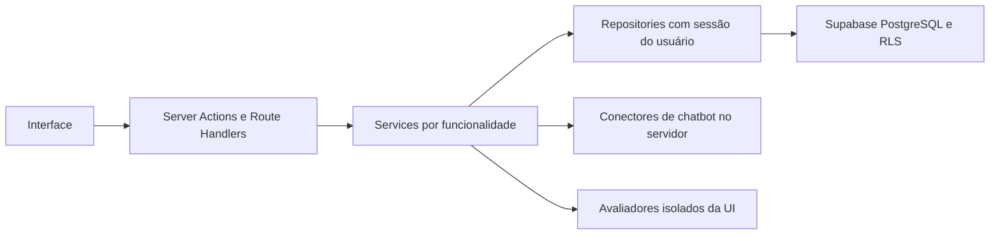

# Arquitetura inicial

## Aplicação única e módulos por funcionalidade

Next.js App Router concentra UI, Server Actions e Route Handlers. Supabase será
a infraestrutura de PostgreSQL, Auth e Storage. Não há Prisma, backend separado,
Redis, monorepo ou infraestrutura obrigatória com Docker.

Existem módulos de autenticação, organização, clientes, agentes e auditorias,
repositories tipados e formulários com React Hook Form/Zod. Rotas e consultas
usam Server Components; formulários interativos são Client Components.
O status de ambiente é lido por páginas dinâmicas, não fixado no build.

## Fluxo de dados previsto

Services e repositories atendem aos cadastros e auditorias persistidas.
O DemoConnector executa respostas fictícias determinísticas; o avaliador
processa essas respostas e os resultados são salvos no banco. Não há timers
de progresso nem métricas inventadas para preencher a interface.

## Supabase SSR

- `client.ts`: cliente browser com configuração pública validada.
- `server.ts`: cliente somente leitura para renderização e cliente que pode
  escrever cookies para Actions e Route Handlers. Não há catch que silencie erros.
- `session.ts`: helper de renovação com `getClaims()`, cookies sincronizados
  entre request/response e resposta privada sem cache. Está ligado ao `proxy.ts`,
  preservando cookies em redirects.
- `config.ts`: validação compartilhada com Zod, sem credenciais de serviço.

Cada operação confirma identidade com `getUser()` e consulta membership.
O cookie HttpOnly da organização é validado contra os vínculos do usuário.
Owner pode cadastrar/editar; member só lê. RLS protege também o acesso direto.

Server Actions usam a verificação de origem do Next.js. Auth tem os limites do
Supabase e limites adicionais por processo com chaves hash e teto de requisições.
Os limites locais reiniciam com a instância e não são controle distribuído;
o limite persistente de autenticação permanece no Supabase.
Não são registrados tokens nem erros remotos completos. Logs de callbacks de
autenticação são omitidos no desenvolvimento.

## Decisões e trade-offs

- Tailwind v4 e componentes shadcn/ui versionados permitem evolução visual simples.
- Fonte do sistema evita dependência de downloads no build.
- URL/chave vazias não impedem a aplicação base de iniciar. Operações reais
  exigirão configuração válida; não existe fallback de dados em memória.
- Publishable keys modernas são aceitas; JWTs legados ficam fora da base inicial.
- Auditorias usam uma requisição por cenário, com persistência atômica. Não há
  background volátil; ao fechar a página, resultados salvos podem ser retomados.
- React Hook Form atende aos formulários da Fase 1; Playwright verifica os
  redirects, validação e navegação. Recharts entra com métricas reais de auditoria.

Referências: [Next.js](https://nextjs.org/docs/app/getting-started/installation),
[Supabase SSR](https://supabase.com/docs/guides/auth/server-side/creating-a-client)
e [shadcn/ui](https://ui.shadcn.com/docs/installation/manual).

## Motor da Fase 2

`ChatbotConnector` separa envio de mensagens da avaliação. `executeTest` trata
falhas técnicas como ERROR. O avaliador exige evidência reconhecida; ausência
de evidência suficiente gera INCONCLUSIVE, não PASS.

Os critérios são snapshots do catálogo no banco. O catálogo SQL foi gerado de
uma fonte JSON e a consistência é verificada por `npm run catalog:check`.
Uma vez aplicada a migration, mudanças de catálogo precisam de nova migration.

RPCs com permissão owner criam auditorias e acrescentam resultados de forma
atômica. Grants impedem alterações diretas nos snapshots e evidências.
Idempotência, row locks e uma execução ativa por organização evitam duplicação.
Não há service_role nas operações da aplicação.

A comparação verifica os critérios preservados antes de declarar correções e
regressões. A taxa é PASS/(PASS+FAIL); erros e inconclusivos são separados.
O estado atual e os testes pendentes estão em [handoff.md](handoff.md).
