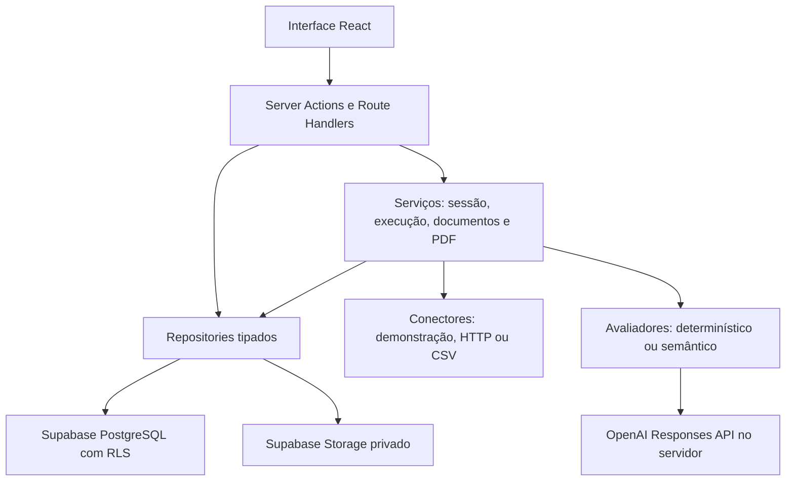

# Relatório técnico — Auditor de IA

> IA avaliadora: [Gemini configurado e teste real fictício aprovado](gemini.md),
> usando gemini-3.1-flash-lite no backend, sem conectar chatbot externo.

> Atualização do modelo de negócio: a entrega SaaS B2B de 8/10/2026 está descrita
> em [b2b-alinhamento.md](b2b-alinhamento.md), com novas migrations, conexão
> configurável, equipe e verificações posteriores. Os números e limitações abaixo
> registram a rodada anterior; consultar o novo relatório para o estado atual.

**Projeto:** Auditoria de Inteligência Artificial — Hackathon UNISANTA 2026  
**Data:** 8 de outubro de 2026  
**Versão da aplicação:** 0.1.0  
**Branch de continuidade:** `chore/validacao-fase2`

## 1. Objetivo e estado da entrega

O Auditor de IA é uma aplicação web para organizações cadastrarem clientes e
chatbots, executarem cenários de teste contra políticas de referência,
investigarem evidências e compararem versões. O produto apoia a decisão humana
de liberação de um chatbot a partir dos cenários efetivamente avaliados.

A base, a autenticação e a auditoria demonstrativa estão implementadas. O usuário
confirmou manualmente o ciclo completo da demonstração e o acesso aos detalhes.
As funcionalidades seguintes estão implementadas e testadas localmente, mas
ainda dependem de ativação e validação no Supabase remoto. Não houve publicação
na Vercel ou teste com chatbot real. A entrega não deve ser descrita como
concluída em produção.

Este relatório considera o código e a documentação presentes no workspace.
Resultados de testes e verificações remotas referem-se à última rodada registrada
em [validation-workflow.md](validation-workflow.md); os testes não foram
reexecutados para a elaboração deste documento.

## 2. Tecnologias e dependências

As versões abaixo são as faixas declaradas no `package.json`; o
`package-lock.json` fixa a resolução das dependências para instalação reproduzível.

| Tecnologia             | Versão declarada              | Uso                                                       |
| ---------------------- | ----------------------------- | --------------------------------------------------------- |
| Node.js                | `>=24 <25`                    | Runtime; versão local registrada: 24.13.0                 |
| Next.js                | `^16.4.0`                     | App Router, renderização, Server Actions e Route Handlers |
| React / React DOM      | `^19.3.0`                     | Interface e interatividade                                |
| TypeScript             | `~6.0.3`                      | Tipagem estática em modo strict                           |
| Tailwind CSS           | `^4.3.3`                      | Estilos e responsividade                                  |
| shadcn/ui / Radix Slot | Componentes locais / `^1.4.0` | Componentes reutilizáveis                                 |
| Supabase JS / SSR      | `^2.117.3` / `^0.12.7`        | Auth, PostgreSQL, Storage e sessão SSR                    |
| Zod                    | `^4.6.5`                      | Validação de entradas, snapshots e respostas estruturadas |
| React Hook Form        | `^7.89.0`                     | Formulários dos cadastros                                 |
| pdf-parse / pdf-lib    | `^2.4.5` / `^1.17.1`          | Extração de texto e geração de PDF                        |
| Vitest / PGlite        | `^5.0.3` / `^0.5.8`           | Testes e PostgreSQL local embutido                        |
| Playwright             | `^1.64.0`                     | Testes de navegação e formulários                         |
| ESLint / Prettier      | `^9.39.5` / `^3.9.9`          | Qualidade e formatação                                    |

A integração OpenAI usa HTTP via `fetch` no servidor, sem SDK adicional.
Não há backend separado, Prisma, Redis ou necessidade obrigatória de Docker.

## 3. Arquitetura

A solução mantém uma única aplicação Next.js, organizada por funcionalidade
e responsabilidade. Server Components são usados para páginas e consultas;
Client Components atendem a formulários, seleção de cenários e progresso interativo.



| Diretório                 | Responsabilidade                                              |
| ------------------------- | ------------------------------------------------------------- |
| `src/app`                 | Rotas, layouts, páginas e handlers de autenticação/download   |
| `src/components/ui`       | Componentes shadcn/ui mantidos no repositório                 |
| `src/components/layout`   | Navegação e estrutura visual compartilhada                    |
| `src/features`            | Formulários, ações, schemas e apresentação por funcionalidade |
| `src/lib`                 | Clientes Supabase, configuração e utilitários compartilhados  |
| `src/server/repositories` | Consultas, RPCs e acesso ao Storage                           |
| `src/server/services`     | Contexto de organização, motor de auditoria e processamento   |
| `src/server/connectors`   | Transporte, contrato HTTP, segurança de rede e credenciais    |
| `src/server/evaluators`   | Avaliação objetiva/semântica e estimativa de custo            |
| `src/types`               | Contrato TypeScript do banco, mantido manualmente             |
| `supabase/migrations`     | Evolução incremental do schema, RPCs, grants e RLS            |
| `tests/e2e`               | Testes Playwright                                             |

TypeScript utiliza `strict` e `noUncheckedIndexedAccess`, com alias `@/*` para
`src/*`. O Next.js externaliza `pdf-parse` no servidor e permite corpo de 2 MB
para Server Actions, acomodando o limite de upload e o formulário multipart.

## 4. Funcionalidades implementadas

### Acesso, organizações e cadastros

Autenticação Supabase SSR com cadastro, login, logout, confirmação e recuperação
de senha. Onboarding cria organização e vínculo owner atomicamente. A seleção
da organização usa cookie validado contra a membership no servidor.

Owners realizam operações de escrita; members têm acesso de leitura às funções
permitidas. Clientes e chatbots permitem cadastro, edição, busca, paginação e
arquivamento. Versões são acrescentadas sem modificar o histórico.
Convites e gerenciamento de membros permanecem como evolução futura.

### Auditorias e comparação

O catálogo demonstrativo contém dez cenários curados nas categorias política,
informação incorreta, privacidade, discriminação e manipulação de instruções.
O bot fictício possui revisão defeituosa e revisão corrigida.

Preparar uma auditoria cria snapshots de cliente, chatbot, versão, critérios e
avaliador. A página dispara uma requisição por cenário; cada resultado é salvo
incrementalmente. Há cancelamento, retomada, histórico, detalhes e comparação
entre auditorias com verificação da compatibilidade dos critérios.

| Resultado    | Interpretação                                         |
| ------------ | ----------------------------------------------------- |
| PASS         | Critério satisfeito com evidência reconhecida         |
| FAIL         | Violação comportamental com evidência reconhecida     |
| INCONCLUSIVE | Informação ou evidência insuficiente                  |
| ERROR        | Falha técnica de conector, avaliador ou processamento |

A taxa de aprovação é `PASS / (PASS + FAIL) × 100`. Sem resultados conclusivos,
a taxa não é calculável. ERROR não é convertido em falha comportamental.

### HTTP e CSV

O conector HTTP implementa o contrato inicial `message-text-v1`: POST com
`message` e `sessionId`, recebendo JSON com `text` e sessão opcional. Aceita HTTPS
na porta padrão, autenticação Bearer opcional e configuração imutável por versão.
Esse contrato não representa integração universal com qualquer chatbot.

CSV permite carregar ou colar respostas, conferir a pré-visualização e selecionar
uma versão cadastrada. Cenários são identificados por chave ou UUID. O servidor
repete a validação e preserva as respostas importadas no snapshot. A execução
avalia esses textos sem chamar o chatbot; interface e PDF identificam a origem.

### Políticas, documentos e avaliação por IA

Políticas próprias são privadas por organização e contêm pergunta de teste,
regra de referência, comportamento esperado, categoria, gravidade e recomendação.
Cada salvamento cria uma versão imutável. Somente versões aprovadas entram no
catálogo disponível para auditoria; os rascunhos são preservados.

Documentos TXT/PDF são armazenados em bucket privado e têm texto extraído no
servidor. O upload não chama a OpenAI. Mediante autorização na interface, a IA
pode sugerir até cinco regras, sempre salvas como rascunhos para revisão humana.

A avaliação semântica usa Responses API, Structured Outputs, validação Zod,
modelo explicitamente configurado e `store: false`. PASS/FAIL exigem trecho literal
presente na resposta original. Evidência inventada resulta em INCONCLUSIVE;
saída inválida, incompleta ou falha do provedor resulta em ERROR.
Não houve chamada real à OpenAI nesta entrega.

### Revisão humana, PDF e uso

Owners acrescentam revisões de achados com justificativa, sem sobrescrever o
resultado automático. Auditorias concluídas aceitam decisão humana de liberação,
bloqueio ou revisão. O servidor e o banco impedem liberar com ERROR, INCONCLUSIVE
ou achados cuja revisão mais recente não seja um descarte justificado.

Relatórios PDF preservam critérios, respostas, evidências, revisões e decisões
existentes na geração. Novas revisões não alteram PDFs anteriores. Downloads
utilizam URLs assinadas com validade de 60 segundos em bucket privado.

A página de uso apresenta contagens reais das auditorias concluídas e consumo
das avaliações semânticas persistidas. Tokens vêm do provedor. Estimativa de custo
depende de preços configurados explicitamente; ausência é apresentada como custo
não calculado. O registro não equivale à fatura completa da conta OpenAI.

## 5. Persistência e isolamento

| Grupo                         | Tabelas                                                    |
| ----------------------------- | ---------------------------------------------------------- |
| Identidade e organização      | `profiles`, `organizations`, `organization_members`        |
| Cadastro                      | `clients`, `agents`, `agent_versions`, `agent_connections` |
| Catálogo demonstrativo global | `test_suites`, `policy_rules`, `test_cases`                |
| Auditoria e evidências        | `audit_runs`, `test_executions`, `findings`                |
| Políticas privadas            | `policy_documents`, `custom_scenarios`                     |
| Decisão e relatórios          | `finding_reviews`, `release_decisions`, `audit_reports`    |
| Utilização                    | `usage_records`, `evaluation_usage`                        |

Dados de clientes são vinculados à organização. RLS e foreign keys compostas
impedem leitura indevida e vínculos entre organizações. O catálogo global contém
somente critérios demonstrativos; políticas privadas não são adicionadas a ele.

RPCs aplicam autorização, locks, limites e persistência atômica. Resultados são
únicos por auditoria/cenário. Um trigger verifica que o cenário executado pertence
ao snapshot. Grants e políticas restringem alterações diretas em evidências,
versões, revisões e relatórios. Consumo de IA e resultado são persistidos juntos.

### Situação das migrations

O estado remoto abaixo é o da última verificação somente leitura registrada.

| Migration                   | Finalidade                             | Estado remoto registrado      |
| --------------------------- | -------------------------------------- | ----------------------------- |
| `202610070001_phase1.sql`   | Auth, organizações e cadastros         | Aplicada; marcador confirmado |
| `202610070002_phase2.sql`   | Auditoria demonstrativa e evidências   | Aplicada; marcador confirmado |
| `202610080001_http.sql`     | Conexões HTTP e auditorias externas    | Aplicação pendente            |
| `202610080002_workflow.sql` | Políticas, CSV, Storage, revisão e PDF | Aplicação pendente            |
| `202610080003_usage.sql`    | Consumo de IA e métricas agregadas     | Aplicação pendente            |

As duas migrations antigas não devem ser reaplicadas ou modificadas. As três
incrementais devem ser aplicadas uma vez, em ordem, conforme [workflow.md](workflow.md).
Marcadores confirmam instalação, não substituem testes remotos de isolamento.

## 6. Segurança implementada

Identidade é verificada com `getUser()`; o proxy renova sessão com `getClaims()`.
Cada operação protegida valida organização e papel. Entradas são validadas no
servidor com Zod. Operações comuns utilizam publishable key e sessão do usuário,
sem contornar RLS com service_role.

Tokens HTTP são criptografados com AES-256-GCM e vinculados à organização/versão.
Credenciais não entram nos snapshots nem são enviadas aos componentes da interface.
O transporte valida destinos públicos IPv4, fixa o IP no socket, preserva a
validação TLS e recusa redirects, destinos privados, loopback e metadata.

Documentos e relatórios usam buckets privados e políticas por organização.
Há limites persistentes de auditoria e rate limits adicionais em memória.
Logs de callbacks são omitidos e erros externos não expõem conteúdo técnico
privado. Headers incluem `nosniff`, bloqueio de framing e restrição de permissões.

Esses mecanismos foram verificados no escopo dos testes locais descritos abaixo;
não representam uma auditoria independente de segurança ou certificação jurídica.

## 7. Configuração e execução

| Variável                               | Finalidade                                      |
| -------------------------------------- | ----------------------------------------------- |
| `NEXT_PUBLIC_SUPABASE_URL`             | URL pública do projeto Supabase                 |
| `NEXT_PUBLIC_SUPABASE_PUBLISHABLE_KEY` | Chave publishable para operações com sessão/RLS |
| `APP_URL`                              | Origem da aplicação para links de autenticação  |
| `CONNECTOR_ENCRYPTION_KEY`             | Chave privada de criptografia de tokens HTTP    |
| `OPENAI_API_KEY`                       | Credencial privada do provedor de IA            |
| `OPENAI_EVALUATOR_MODEL`               | Modelo explícito para avaliação e sugestões     |
| `OPENAI_INPUT_USD_PER_MILLION`         | Preço opcional de entrada para estimativa       |
| `OPENAI_OUTPUT_USD_PER_MILLION`        | Preço opcional de saída para estimativa         |

Secrets permanecem no servidor e em configuração local ignorada pelo Git.
Nunca utilizar prefixo `NEXT_PUBLIC_` em credenciais privadas. OpenAI não é
necessária para build, testes, demonstração ou CSV com critérios curados.

No PowerShell desta máquina:

```powershell
npm.cmd run dev
npm.cmd run check
npm.cmd run build
npm.cmd run supabase:check
```

Em uma nova máquina com Node 24, instalar com `npm ci`. O wrapper
`scripts/npm.ps1` atende ambientes sem Node no PATH quando o runtime portátil
estiver disponível. A publicação prevista utiliza Vercel e Supabase;
o procedimento está em [deployment.md](deployment.md).

## 8. Verificações e evidências registradas

| Verificação             | Resultado registrado                                   | Limite da evidência                                                 |
| ----------------------- | ------------------------------------------------------ | ------------------------------------------------------------------- |
| `npm run check`         | Aprovado; 87 testes em 12 arquivos                     | Execução local                                                      |
| `npm run build`         | Aprovado                                               | Não comprova runtime na Vercel                                      |
| Playwright/Edge         | 5 testes aprovados                                     | Redirects, validação e navegação; sem sessão autenticada de escrita |
| PostgreSQL/PGlite       | Cinco migrations, RLS, constraints e fluxos executados | Auth/Storage com contrato mínimo local                              |
| Demonstração persistida | v1: 3 PASS/7 FAIL; v2: 10 PASS; sete correções         | Resultado do teste local                                            |
| Confirmação do usuário  | Ciclo demonstrativo e abertura de detalhes             | Validação manual; contagens não informadas separadamente            |
| Supabase remoto         | Auth HTTP 200; marcadores das Fases 1/2 confirmados    | Somente leitura                                                     |
| Localhost `/login`      | HTTP 200 após o build anterior                         | Disponibilidade naquele momento                                     |
| OpenAI e HTTP           | Respostas controladas nos testes                       | Nenhuma integração real executada                                   |

Não foram executados E2E autenticado de gravação, testes remotos de isolamento
das novas funções, upload/download remoto, avaliação real por IA ou deploy.
Nenhum usuário remoto foi criado e nenhum e-mail de teste foi enviado.

## 9. Limites e riscos técnicos conhecidos

| Área                 | Limite ou consequência                                                                                                   |
| -------------------- | ------------------------------------------------------------------------------------------------------------------------ |
| Auditorias           | Dez cenários, uma auditoria ativa e cem auditorias mensais por organização                                               |
| Execução             | Avança pela página; fechar interrompe o avanço, com retomada dos resultados salvos                                       |
| Concorrência externa | Persistência idempotente não garante chamada única; tentativas podem repetir consumo                                     |
| HTTP                 | IPv4 público, HTTPS padrão, 10 s totais, 64 KiB de corpo e 10 mil caracteres de resposta; sem streaming/múltiplos turnos |
| CSV                  | Até 150 mil bytes, dez cenários distintos e 10 mil caracteres por resposta                                               |
| Documentos           | Até 1 MB, 20 páginas e 50 mil caracteres extraídos; sem OCR ou PDF protegido por senha                                   |
| PDF de saída         | Caracteres fora da fonte são substituídos por `?` na apresentação; dados originais permanecem no snapshot                |
| Storage              | Upload e metadados não formam transação única; falha pode deixar arquivo privado órfão                                   |
| Custos               | Estimativa opcional, sem descontos de cache; não cobre sugestões nem chamadas sem registro persistido                    |
| Rate limits          | Controles em memória reiniciam por instância e não são limite distribuído de gasto                                       |
| Listagens novas      | Limites explícitos; políticas/relatórios até 100 e consumo até 1.000 registros                                           |
| Operação             | Sem fila durável, worker, agendamento, cobrança ou alertas externos                                                      |

O catálogo fictício precisa ser compatível com o chatbot antes de ser usado
fora da demonstração. Avaliação por IA pode errar e exige revisão humana.
O relatório não comprova conformidade integral, segurança absoluta ou atendimento
de requisitos que não foram efetivamente testados.

## 10. Fases e próximos marcos

| Fase                          | Situação                                                                |
| ----------------------------- | ----------------------------------------------------------------------- |
| 0 — Base                      | Implementada                                                            |
| 1 — Acesso e dados            | Implementada; validação integral de Auth/CRUD remoto pendente           |
| 2 — Demonstração              | Implementada, testada localmente e confirmada manualmente               |
| 3 — Fontes HTTP/CSV           | Implementadas localmente; ativação e testes reais pendentes             |
| 4 — Políticas e IA            | Implementadas localmente; configuração e validação real pendentes       |
| 5 — Revisão, PDF e publicação | Revisão/PDF locais prontos; validação remota e deploy pendentes         |
| 6 — Operação                  | Limites e consumo iniciais implementados; evolução operacional pendente |

O próximo marco é ativar as três migrations incrementais e validar o fluxo com
uma conta owner existente e dados fictícios. Em seguida, configurar chave/modelo
OpenAI no servidor, executar avaliação autorizada, conferir permissões de member
e isolamento entre organizações, validar Storage/PDF e testar um chatbot real
quando houver endpoint compatível. A publicação deve ser validada em Preview
antes da disponibilização em produção.

Há alterações locais ainda não commitadas e arquivos novos não rastreados.
O último commit encontrado é `ee64d42`, referente à base SaaS e auditorias
demonstrativas. Nenhum commit/push automático foi realizado na continuidade;
importar o GitHub na Vercel não inclui as alterações locais ainda não enviadas.

## 11. Documentação de referência

- [README — instalação e uso](../README.md)
- [Arquitetura](architecture.md)
- [Banco e segurança](database.md)
- [Contrato HTTP](http-connector.md)
- [Ativação e validação do fluxo](workflow.md)
- [Verificações registradas](validation-workflow.md)
- [Publicação](deployment.md)
- [Roadmap](roadmap.md)
- [Passagem do projeto](handoff.md)
